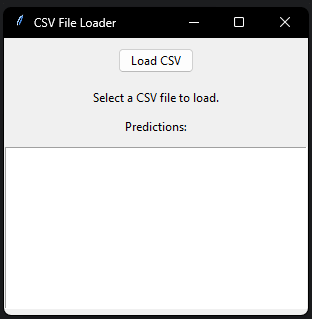
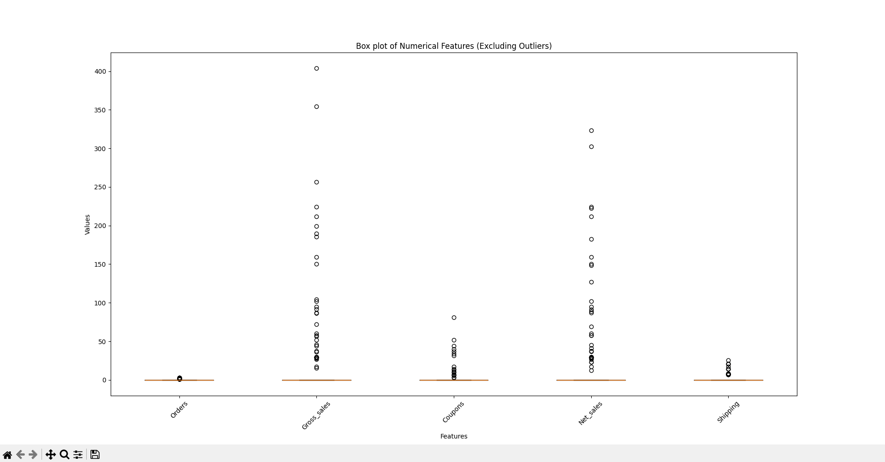
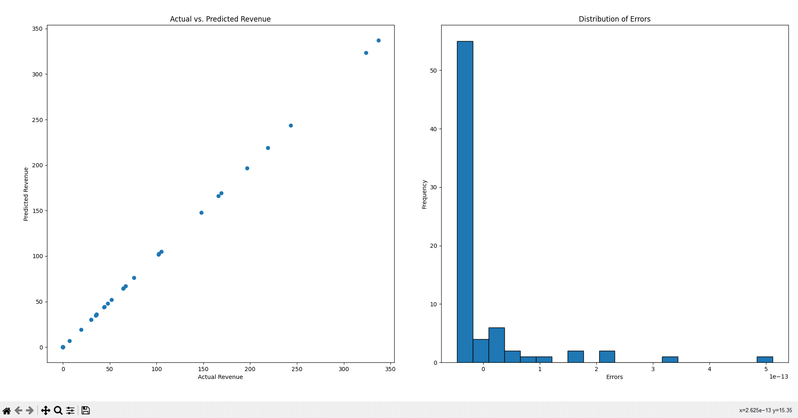
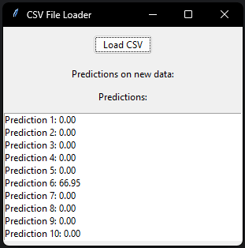
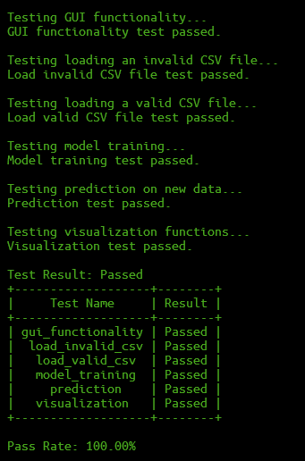

# Revenue Analysis Tool
This Python script provides a comprehensive tool for analyzing revenue data from CSV files using linear regression. It offers a graphical user interface (GUI) powered by tkinter for easy interaction, matplotlib for visualizations, and pandas for efficient data manipulation.

# Installation 
1. Clone the repository:

`git clone https://github.com/xkevan19/revenue-analysis-tool.git`

2. Install the required dependencies:

### Requirements
* Python 3.x: The script is compatible with Python 3.x versions.

_Ensure you have the following libraries installed:_

* tkinter: For GUI components.
* matplotlib: For data visualization.
* numpy: For numerical operations.
* pandas: For data manipulation and analysis.
* scikit-learn: For machine learning functionalities.

You can install the required libraries using **pip**:

`pip install tkinter matplotlib numpy pandas scikit-learn`

You can use this requirements.txt file to ensure you have all the necessary libraries installed in your Python environment by running:

`pip install -r requirements.txt`

3. Run the application via command line/terminal:

`python main.py`

## Usage
1. Run the Script: Execute the script in your Python environment.
2. Load CSV File: Click the "Load CSV" button in the GUI to select a CSV file containing revenue data.
3. Data Processing: The script will preprocess the data, including handling outliers, splitting it into training and testing sets, and training a linear regression model.
4. Predictions: After training, predictions will be made on new data (assuming a file named 'new_data.csv'). Predictions will be displayed in the GUI interface.
5. Visualizations: Various visualizations will be generated, including comparisons between actual and predicted revenue, histograms of prediction errors, and (if applicable) trends over time.

## Functions
1. load_and_process_data(file_path): Loads the CSV file, preprocesses the data, detects outliers, and splits the data into training and testing sets.
2. train_model(X_train, y_train): Trains a linear regression model using grid search for hyperparameter tuning.
3. predict_new_data(best_model, new_df_without_total_sales): Makes predictions on new data using the best model.
4. detect_outliers_iqr(data, threshold=1.5): Detects outliers in numerical features using the Interquartile Range (IQR) method.

## Classes
RevenueAnalysis: Implements the GUI interface using tkinter for loading CSV files, displaying predictions, and visualizing results.

## Notes
* Column Requirements: Ensure that the CSV file contains columns named 'Gross sales', 'Net sales', 'Total sales', 'Returns', 'Coupons', 'Taxes', and 'Shipping'.
* New Data File: The new data CSV file should be named 'new_data.csv' and have the same column names as the training data.

## Screenshot

## Test Functions
`TestFunctions.py` contains a set of unit tests designed to ensure the functionality and reliability of the revenue analysis script. These tests cover various aspects such as loading CSV files, model training, predictions, visualization functions, and GUI functionality.

## Test Functions Requirements
* unittest: For writing and running tests.
* matplotlib.pyplot: For generating plots for visualization tests.
* pandas: For creating DataFrame objects for testing.
* prettytable: For displaying test results in a tabular format.

Once you've installed the initial requirements you can pip install the remaining required library.

`pip install prettytable`

_The unittest library comes pre-installed with Python, so you don't need to worry about installing it separately. When 
you write and run tests using unittest, you can import it directly in your test script without needing to install 
it via pip._

## Test Cases
1. Load Valid CSV
- Objective: Ensure that the script correctly loads a valid CSV file.
- Test Method: Reads a valid CSV file and checks if the DataFrame is not empty.
2. Load Invalid CSV
- Objective: Verify the script's behavior when attempting to load an invalid CSV file.
- Test Method: Tries to load a non-existent CSV file and checks if an IOError is raised.
3. Model Training
- Objective: Confirm that the script can train a linear regression model using dummy training data.
- Test Method: Generates dummy training data, trains a model, and checks if the model object is not None.
4. Prediction
- Objective: Validate the script's ability to make predictions on new data using a dummy model.
- Test Method: Generates dummy new data, creates a dummy model, makes predictions, and verifies if the predictions 
  match expected values.
5. Visualization
- Objective: Ensure that visualization functions produce the expected plots.
- Test Method: Generates dummy data, plots a scatter plot and a histogram, and verifies if the plots are created 
  without errors.
6. GUI Functionality
- Objective: Test the functionality of the GUI interface.
- Test Method: Simulates GUI interaction by instantiating the RevenueAnalysis class and calling its main() method. 
  Verifies if the GUI operates without raising exceptions.

### Test Results

The script runs the tests using unittest and reports the results, including pass/fail status for each test case and the overall pass rate. The results are displayed in a table format for easy comprehension.

Feel free to run these tests whenever modifications are made to the revenue analysis script to ensure its integrity and reliability.

## Contributing
Contributions to this project are welcome! Here's how you can contribute:

* Fork the repository
* Create your feature branch (git checkout -b feature/YourFeature)
* Commit your changes (git commit -am 'Add some feature')
* Push to the branch (git push origin feature/YourFeature)
* Create a new Pull Request

## Credits
The project utilizes the following libraries:
* [tkinter](https://docs.python.org/3/library/tkinter.html): For GUI components.
* [matplotlib](https://matplotlib.org/): For data visualization.
* [numpy](https://numpy.org/): For numerical operations.
* [pandas](https://pandas.pydata.org/): For data manipulation and analysis.
* [scikit-learn](https://scikit-learn.org/): For machine learning functionalities.

Feel free to modify the script according to your specific requirements! If you encounter any issues or have suggestions for improvements, please let me know.

## Developer
- [Github](https://github.com/xkevan19)
- [LinkedIn](https://www.linkedin.com/in/kevansuchit/)

With over 2 years of industry experience, I've refined the full cycle of web application development, from planning to deployment. Proficient in SQL, web development, data analytics, UI/UX design, and product management, I deliver tailored solutions that blend technical expertise with client-centricity. I excel in pre-sale engineering and customer service, driving innovation and inspiring others in the evolving IT landscape.
